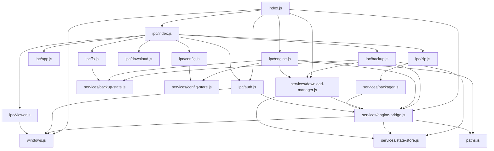
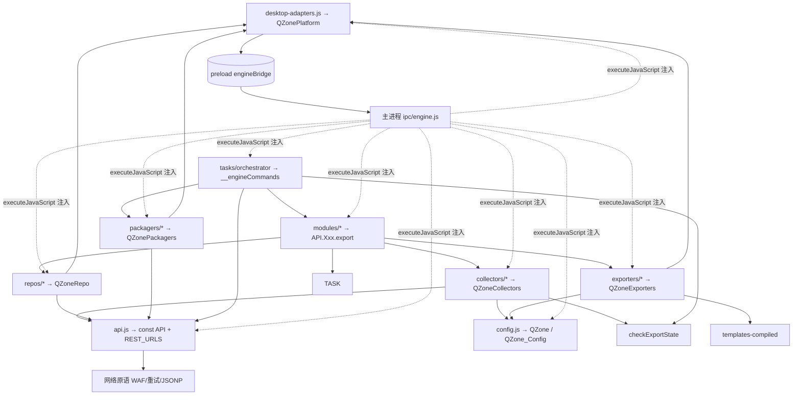
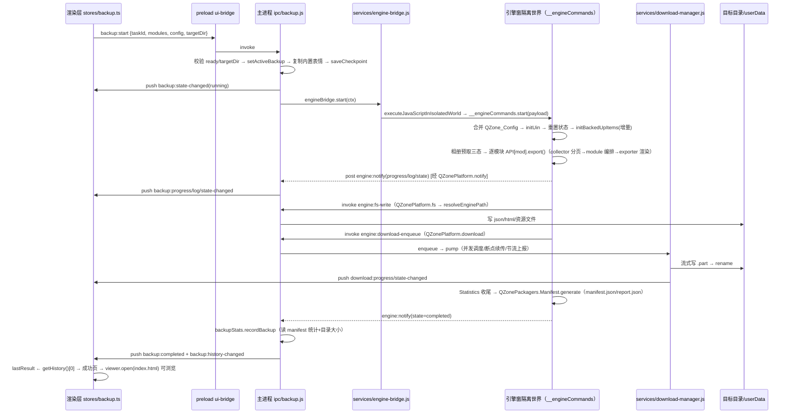

# QZoneArchiver 桌面版（qzone-archiver-desktop v4.0.0）架构分析报告

> 分析对象：`desktop/`（Electron 43 + Vue 3 + 引擎五层）
> 报告覆盖：整体架构、五大子系统逐文件职责、同系统内与跨系统文件依赖、IPC 契约、备份数据流、构建与发布链路。

---

## 1. 项目定位与总体架构

**产品形态**：QQ 空间历史数据备份桌面版。完整流程为 **内嵌登录（隐藏引擎窗口加载 user.qzone.qq.com）→ 五层引擎采集 → 主进程流式下载媒体 → 生成可离线浏览的 SPA/HTML 档案 → 内置 viewer 窗口浏览**。完全替代浏览器扩展版（扩展端 v3.3.0 冻结基线快照 + 独立五层重构演进）。

**技术栈**：Electron 43（ESM）、Vue 3.4 + Vue Router 4（hash 模式，无 Pinia）、Vite 5 构建渲染层、electron-builder 打包（NSIS + portable）、主进程 archiver 压缩、`node:net.fetch` 流式下载。

### 1.1 顶层进程/子系统划分

```
┌─────────────────────────── Electron 应用（单实例） ───────────────────────────┐
│                                                                                │
│  ┌─ src/main/ ── 主进程 ─────────────────────────────────────────────────┐     │
│  │  index.js(入口) windows.js(3窗口) ipc/×(9个) services/×(6个) paths.js │     │
│  └──────┬──────────────────────┬───────────────────────────┬─────────────┘     │
│         │ IPC invoke/推送       │ executeJavaScriptInIsolatedWorld │ fs/下载   │
│  ┌──────▼──────────┐   ┌───────▼───────────────────────┐   ┌───────▼──────┐    │
│  │ 主 UI 窗口      │   │ 引擎窗口（隐藏, persist:qzone）│   │ viewer 窗口  │    │
│  │ file://renderer │   │ https://user.qzone.qq.com      │   │ file://备份  │    │
│  │  preload:       │   │  preload: engine-bridge.cjs    │   │ 产物index.html│   │
│  │  ui-bridge.cjs  │   │  隔离世界100: 引擎五层脚本      │   │              │    │
│  └──────┬──────────┘   └───────────────────────────────┘   └──────────────┘    │
│         │ window.api                                                        │
│  ┌──────▼───────────────────────────────────────────────┐                     │
│  │ src/renderer/ Vue3（views + components + 3 个 store）  │                     │
│  └───────────────────────────────────────────────────────┘                     │
└────────────────────────────────────────────────────────────────────────────────┘
```

### 1.2 目录总览与分层职责

| 目录 | 子系统 | 职责 | 关键文件 |
|---|---|---|---|
| `src/main/` | Electron 主进程 | 窗口管理、IPC 路由、引擎注入、流式下载、压缩打包、状态持久化 | `index.js` `windows.js` `ipc/*` `services/*` |
| `src/preload/` | 桥接层（2 个） | 主 UI 白名单 API（`window.api`）；引擎窗最小桥（`window.engineBridge` 仅 invoke/post 两原语） | `ui-bridge.cjs` `engine-bridge.cjs` |
| `src/renderer/` | 渲染层 | Vue 3 界面：首页/备份向导/归档/设置；三个模块级 store（非 Pinia） | `App.vue` `stores/{auth,config,backup}.ts` `views/*` `components/*` |
| `src/engine/` | 采集引擎（五层） | 在 qzone 页面隔离世界运行：网络采集、数据处理、增量、导出、打包清单 | 见 §4 |
| `scripts/` | 构建辅助 | 模板重编译、扩展端基线同步 | `recompile-templates.mjs` `sync-baseline.mjs` |
| `assets/emoticons/` | 静态资产 | 内置 QQ/微信表情包（备份时复制到产物，无需网络下载） | `manifest.json` + 300+ 表情图 |
| 根配置 | 构建/发布 | Vite 渲染层构建、electron-builder 双格式打包 | `package.json` `vite.config.ts` `electron-builder.yml` |

---

## 2. 主进程子系统（src/main/）——文件级分析

### 2.1 逐文件职责

| 文件 | 职责 | 依赖（import 自） | 被谁依赖 |
|---|---|---|---|
| `index.js` | 应用入口：单实例锁 → 注册两套 IPC → 加载下载队列 → 建主/引擎窗口 → 认证轮询 → 引擎窗口生命周期监听（did-navigate 离开 qzone 置 `engineBridge.ready=false`；did-finish-load 回 qzone 自动重注入；console-message 过滤转发） | `windows.js` `ipc/index.js` `ipc/engine.js` `ipc/auth.js` `services/{engine-bridge,download-manager}.js` | —（package.json `main`） |
| `windows.js` | 三窗口工厂：主窗（1200×800，preload=ui-bridge）、引擎窗（隐藏 1280×900，`partition:'persist:qzone'` 持久化登录态，preload=engine-bridge）、viewer 窗（加载备份产物）；`ensureWindows()` 供二次启动/activate 复用；`showEngineWindow()` 扫码登录置前 | `electron` | `index.js` `ipc/auth.js` `ipc/viewer.js` `services/engine-bridge.js` |
| `paths.js` | 唯一常量 `ENGINE_DIR = src/engine` | `node:path` | `services/engine-bridge.js` `ipc/engine.js` |
| `ipc/index.js` | 聚合注册主 UI 侧 8 组 IPC（app/auth/config/backup/download/fs/zip/viewer） | `ipc/{app,auth,config,backup,download,fs,zip,viewer}.js` | `index.js` |
| `ipc/app.js` | `app:get-info`（版本/平台）、`app:open-external`（shell 外链） | `electron` | `ipc/index.js` |
| `ipc/auth.js` | 登录检测/注销/轮询：`getAuthStatus()`（读 httpOnly cookie `p_skey` 判登录 → 引擎 `getLoginStatus()` 取昵称头像）；`watchAuthStatus(5000ms)` 登录翻转推送 + 2s 后自动最小化引擎窗；`auth:logout` 全量清 cookie/storage | `services/engine-bridge.js` `windows.js` | `index.js` `ipc/index.js` |
| `ipc/backup.js` | **备份编排入口**：`backup:start` 校验引擎就绪 → `setActiveBackup(ctx)` → 复制内置表情到目标目录 → 写检查点 → 推 running → `engineBridge.start()`；pause/resume/cancel 与下载管理器**双联动**；`get-state`（检查点恢复入口）/`get-history`/`list-albums`/`engine-inject`（重注入重试） | `services/{engine-bridge,state-store,backup-stats,download-manager}.js` | `ipc/index.js` |
| `ipc/config.js` | `config:get/set/reset` + 配置文件导入导出（JSON 文件选择） | `services/config-store.js` | `ipc/index.js` |
| `ipc/download.js` | 下载控制通道转发（start/pause/resume/cancel/clear-done/get-state，UI 侧下载向导遗留入口） | `services/download-manager.js` | `ipc/index.js` |
| `ipc/engine.js` | **引擎窗能力通道**（见 §2.3 契约表）：storage（等价 chrome.storage）/fs（Filer 虚拟路径映射）/resource-read（`..` 穿越校验）/cookie/network（带 Referer+UA 的 net.fetch）/download-enqueue/notify 事件分派（completed 时联动 `backupStats.recordBackup` → history-changed + completed） | `services/{engine-bridge,config-store,backup-stats,download-manager}.js` `paths.js` | `index.js` |
| `ipc/fs.js` | 目录选择对话框、打开路径/资源管理器、保存对话框、写文本、历史备份扫描（递归找含 index.html 的目录） | `services/backup-stats.js`（dirBytes/countFiles） | `ipc/index.js` |
| `ipc/viewer.js` | `viewer:open`：目标目录 index.html → 打开内置浏览窗口 | `windows.js` | `ipc/index.js` |
| `ipc/zip.js` | `zip:create`：目录 → zip（调用主进程 archiver） | `services/packager.js` | `ipc/index.js` |
| `services/engine-bridge.js` | **核心枢纽**：① `ENGINE_SCRIPTS`（59 个文件固定顺序）逐个 `executeJavaScriptInIsolatedWorld(100)` 注入；② `exec(code,{returnValue})` 远程执行；③ `__engineCommands` 路由（start/pause/resume/cancel/getLoginStatus）；④ `activeBackup` 上下文 + `resolveEnginePath()`（`/QQ空间备份_uin/xxx` → targetDir/xxx，路径穿越校验）；⑤ `sendToUi()` 推送；⑥ `saveCheckpoint()` | `windows.js` `paths.js` `services/state-store.js` | `index.js` `ipc/{auth,backup,engine,zip}` `services/{download-manager,packager}` |
| `services/download-manager.js` | **M2b 流式下载**：并发调度（10 常规 + 2 大文件 >50MB 专用槽）、`.part`+Range 断点续传、http→https 升级（规避 Chromium 拦截）、已存在跳过、`statfs` 磁盘预检、60s 空闲超时重试、500ms/1% 双阈值进度节流、暂停中断/取消清空、`media` 标志区分通用资源 | `services/{engine-bridge,state-store}.js` | `index.js` `ipc/{backup,download,engine}` |
| `services/state-store.js` | userData/state 持久化：`checkpoints/{taskId}.json`（备份检查点）、`downloads.json`（下载队列）；tmp+rename 原子写 | `electron` | `engine-bridge.js` `download-manager.js` `ipc/backup.js` |
| `services/config-store.js` | `config.json`（UI 配置）+ `engine-storage.json`（引擎 storage，等价 chrome.storage 的扁平 JSON map：QZone_Config/Backedup 等） | `electron` | `ipc/config.js` `ipc/engine.js` |
| `services/backup-stats.js` | 备份历史：`backup-history.json`；`recordBackup()` 幂等记录（同 taskId 去重），读 manifest.json 汇总模块条目数 + dirBytes/countFiles 截断统计；`dirBytes/countFiles` 亦被 fs IPC 扫描复用 | `electron` | `ipc/{backup,engine,fs}` |
| `services/packager.js` | archiver 流式 zip（zlib level 6，以目录名为 zip 内顶层目录），progress 事件节流推送 `zip:progress` | `services/engine-bridge.js` | `ipc/zip.js` |

### 2.2 主进程内部依赖图



要点：`engine-bridge` 是服务层中心（被 5 处依赖）；`download-manager` 被 backup/download/engine 三个 IPC 复用；依赖方向全部单向、无环。

### 2.3 IPC 契约总表（三类通道）

**① 主 UI → 主进程（invoke，preload ui-bridge 白名单代理）**

| 通道 | 功能 | 所在文件 |
|---|---|---|
| `app:get-info` / `app:open-external` | 版本信息 / 外链 | ipc/app.js |
| `auth:get-status` / `auth:show-login` / `auth:get-overview` / `auth:logout` | 登录态 | ipc/auth.js |
| `config:get` / `config:set` / `config:reset` / `config:import` / `config:export` | UI 配置 | ipc/config.js |
| `backup:start` / `pause` / `resume` / `cancel` / `get-state` / `get-history` / `list-albums` / `engine-inject` | 备份控制 | ipc/backup.js |
| `download:*`（start/pause/resume/cancel/clear-done/get-state） | 下载控制 | ipc/download.js |
| `fs:select-directory` / `open-path` / `show-in-folder` / `scan-backups` / `save-dialog` / `write-text` | 文件系统 | ipc/fs.js |
| `zip:create` | 打包 | ipc/zip.js |
| `viewer:open` | 内置浏览 | ipc/viewer.js |

**② 主进程 → 主 UI（webContents.send 推送，ui-bridge `api.on` 白名单 13 通道）**

| 通道 | 发送方 |
|---|---|
| `auth:status-changed` | ipc/auth.js（轮询翻转/登出） |
| `backup:state-changed` / `backup:progress` / `backup:log` / `backup:module-done` / `backup:completed` / `backup:history-changed` | services/engine-bridge.js + ipc/engine.js（转发引擎 notify） |
| `download:state-changed` / `download:progress` / `download:item-failed` | services/download-manager.js |
| `zip:progress` | services/packager.js |
| `log:batch` | （白名单预留，暂无发送方） |

**③ 引擎窗 → 主进程（engine-bridge preload 原语 → ipc/engine.js）**

| 通道 | 类型 | 功能 |
|---|---|---|
| `engine:storage-get/set/remove` | invoke | 等价 chrome.storage（QZone_Config/Backedup 持久化） |
| `engine:fs-write/read/exists/mkdir/remove/list` | invoke | Filer 虚拟路径 → targetDir 真实路径（resolveEnginePath 剥 `/QQ空间备份_uin` 首段 + 穿越校验） |
| `engine:resource-read` | invoke | 读引擎本地资源（templates/export-resources），`..` 校验 |
| `engine:cookie-get` | invoke | 读 httpOnly cookie |
| `engine:download-enqueue` | invoke | 媒体入队主进程下载管理器 |
| `engine:network-mimetype` / `engine:network-json` | invoke | 主进程带 Referer/UA 的 net.fetch（等价扩展 background 能力） |
| `engine:ready` | post | 注入完成标记（当前仅占位） |
| `engine:notify` | post | `{type,data}` 分派：progress→`backup:progress`；log→`backup:log`；state→`backup:state-changed`（completed 时联动 recordBackup + `backup:completed`）；module-done→`backup:module-done` |

---

## 3. 渲染层子系统（src/renderer/）——文件级分析

### 3.1 基建与入口

- `index.html`：CSP `default-src 'self'`；`#app` 挂载点。
- `src/main.ts`：`createApp(App).use(router).mount('#app')`。**无 Pinia**——"store" 实为模块级 ref/reactive 单例，`useXxxStore()` 只是取值器。
- `router.ts`：`createWebHashHistory`（file:// 加载必需），4 条路由：`/`→HomeView、`/backup`→BackupView、`/archives`→ArchivesView、`/settings`→SettingsView。
- `env.d.ts`：window.api 类型契约（存在轻微漂移：`backup.engineInject` 实际使用但未声明；`zip.create`、`config.import/export`、`fs.scanBackups` 等已声明未调用）。

### 3.2 Store（模块级单例）

**`stores/auth.ts`**（登录态）：`reactive{loggedIn,qqNumber,nickname,avatar}`；`initAuth()` 幂等订阅 `auth:status-changed`；`refresh/login/logout` 调 `window.api.auth.*`。

**`stores/config.ts`**（474 行，最重）：
- 常量：`MODULES`（11 模块）、`MODULE_META/ICONS`、`MODULE_KEYS`（10，不含 Statistics）、`EXPORT_OPTS`(SPA/HTML/MarkDown/JSON)、`INCREMENT_OPTS`(Full/Last/Custom)、`COMMON_SCHEMA`(17 项)、`MODULE_SCHEMA`（10 模块逐项）、`DEV_SCHEMA`（腾讯地图 Key）；`defaultSettings()` 逐字段对齐引擎 `config.js Default_Config`。
- 状态：`selected`（默认仅 Messages）、`targetDir`、`settings`、`albums/albumsLoading/albumError/albumSel`；getter：`selectedCount/selectedModules/albumClassNames`（按相册分类名分组）。
- 关键函数：`buildEngineConfig()` —— **UI 设置 → 引擎 QZone_Config 的契约转换器**：按 schema 白名单逐字段提取、`range` 类型拆 min/max、仅 Custom 增量模式透传 IncrementTime、Photos 附加 `albumSelect`（三态语义：undefined=全量 / `[]`=不备份相册 / 非空=按选），最后 `toPlain` 深拷贝（防 Vue reactive proxy 跨 IPC DataCloneError）。
- watch 持久化：`selected`→`config:set({selectedModules})`；`settings`→300ms 防抖 `config:set({engineSettings})`；勾选 Photos 且已登录 → 自动 `loadAlbums()`。

**`stores/backup.ts`**（394 行，备份运行状态机）：
- 状态：`busy/paused/engineReady/engineFailed/progress/logs/elapsedSec/downloads/downloadFilter/downloadModule/lastResult`。
- 动作：`startBackup()`（生成 `task-时间戳-随机` taskId → `backup.start({taskId,modules,targetDir,config})`）、`pause/resume`（乐观更新+失败回滚）、`cancel`、`retryEngine`（engine-inject 重试）、`clearDoneDownloads`、`exportLogs`、`initBackup/disposeBackup`（订阅/退订）。
- **事件驱动状态机**：`backup:state-changed` 的 engine-ready/running/paused/completed/cancelled 驱动 busy/paused/engineReady/engineFailed；`backup:progress` 驱动进度条；`backup:completed` 拉 `getHistory()[0]` 置 `lastResult`（成功页数据源）；`download:*` 三通道维护下载列表（`ignoreAfterCancel` 防取消后残留）；`elapsedSec` 用 Date.now 差值计时（防窗口后台节流丢拍）。

### 3.3 视图/组件树与引用关系

```
App.vue（shell + 全局模态：欢迎/帮助/退出确认；onMounted 依序 app:get-info→initConfig→欢迎引导→initAuth→initBackup；20s 未 engine-ready 置 engineFailed）
 ├─ layout/TopBar.vue      —— 引擎连接状态（engineFailed→显示"连接失败"可重试 retryEngine）、登录入口
 ├─ layout/SideNav.vue     —— 导航
 ├─ <router-view>
 │   ├─ HomeView    —— home/{LoginCard, StatSummary, LastBackupCard, PrivacyNote}（getHistory 聚合统计 + 订阅 history-changed 实时刷新）
 │   ├─ BackupView  —— backup/{StepIndicator, ModulePicker, DirPicker, DownloadPanel, LogPanel, SuccessPanel} + ui/ConfirmDialog
 │   ├─ ArchivesView—— 历史备份列表（viewer.open / showInFolder + 订阅 history-changed）
 │   └─ SettingsView —— ui/CSelect.ts + ConfirmDialog（schema 驱动表单；Photos tab 相册多选；onBeforeRouteLeave 未保存拦截）
 └─ ui/ConfirmDialog.vue   —— 全局复用
```

视图驱动逻辑：BackupView 按 `busy→进行中 / lastResult→成功页 / 否则→三步向导` 三态渲染；StepIndicator 三步 = 选择内容 / 保存位置 / 开始备份。

### 3.4 渲染层与主进程协作

- invoke：`app:get-info`；`auth:get-status|show-login|logout`；`config:get|set`；`backup:start|pause|resume|cancel|get-history|list-albums|engine-inject`；`download:get-state|clear-done`；`fs:select-directory|show-in-folder|open-path|save-dialog|write-text`；`viewer:open`。
- on：实际使用 `auth:status-changed`、`backup:state-changed|progress|log|module-done|completed|history-changed`、`download:state-changed|progress|item-failed`（白名单中 `zip:progress`、`log:batch` 未用）。
- 协作模式：渲染层"乐观更新 + 事件回填"；引擎在独立隐藏窗口运行，渲染层仅经 `backup:engine-inject` 触发注入，其余全部通过状态/进度/日志事件感知。

---

## 4. 引擎子系统（src/engine/）——五层架构

> 引擎脚本**无模块系统**：由主进程 `engineBridge.inject()` 按 `ENGINE_SCRIPTS` 固定顺序在引擎窗口**隔离世界 100** 逐个执行，靠全局命名空间装配。注入顺序即依赖顺序。

### 4.1 注入顺序与全局命名空间装配

主进程 `engineBridge.inject()` 按 `ENGINE_SCRIPTS` 固定顺序（共 59 个脚本）在**隔离世界 100** 逐个执行。顺序即依赖顺序（引擎无 import/require）：

```
① desktop-adapters.js（1）          → window.QZonePlatform（平台适配层 P1，唯一平台接口）
② vendor/*（5）                     → jquery / lodash / turndown / template(artTemplate) / xlsx
③ utils.js                          → Date/String/Array 原型扩展（format/replaceAll/getIndex/remove）
④ config.js                         → Default_Config + var QZone = {...}（数据命名空间）+ QZone_Config
⑤ emoticons.js                      → window.__EMOTICONS_MANIFEST（内置表情清单）
⑥ templates-compiled.js             → window.__templates__（17 个 artTemplate 预编译函数 + __modifierMap__）
⑦ api.js                            → const API = { Utils, Common, Messages, Blogs, Diaries, Friends,
                                       Boards, Photos, Videos, Favorites, Shares, Visitors }（词法全局，不挂 window）
                                       + REST_URLS（40+ 个 QQ 空间接口端点）+ 网络原语层（WAF 检测/重试/JSONP）
⑧ collectors/*（12：index+base+10） → window.QZoneCollectors.*（采集循环原语 + 10 个数据类型采集器）
⑨ repos/*（6：index/writer/incremental + modules/{messages,favorites,shares}）→ window.QZoneRepo.*
⑩ exporters/*（12：index/common+10）→ window.QZoneExporters.*（HTML/MarkDown/JSON/SPA 渲染+资源复制）
⑪ packagers/*（2：links/manifest）  → window.QZonePackagers.{Links,Manifest}
⑫ modules/*（11：common+10）        → 向 API 命名空间挂业务方法：API.Messages.export = ... 等
⑬ tasks/*（4：state/progress/downloader/orchestrator）
⑭ desktop-runner.js                 → 薄壳：校验 QZonePlatform 与 __engineCommands 装配完成
```

**装配时序要点**：注册约定统一为 `window.X = window.X || {}` + `X.Name = {...}`；collectors 引用 `API.Common.callNextPage/unionBackedUpItems` 等来自 modules/common.js 的**后注入**函数——靠"注入时只赋值、运行时才调用"规避顺序；`API` 为 `const` 声明的词法全局（不挂 window），注释明确各脚本直接引用。

### 4.2 关键全局契约

| 全局对象 | 定义处 | 说明 |
|---|---|---|
| `window.QZonePlatform` | desktop-adapters.js | 五层唯一平台接口：`storage/fs/zip/download/notify/cookies/network/resources/setTargetDir`。全部经 `window.engineBridge`（preload 两原语）→ 主进程 |
| `API`（词法 const，不挂 window） | api.js:178 | 网络原语 + 各模块业务方法容器；modules/* 向其挂方法，collectors/tasks/exporters 引用它 |
| `window.QZone`（var QZone） | config.js:858 | 运行时数据命名空间：`QZone.Messages.Data`、`QZone.Common.{Target,Owner}`、`QZone.Photos.Album.{Data,Select}`、各模块 `OLD_Data` 等 |
| `window.QZone_Config` | config.js | 全量引擎配置（Default_Config 打底）；orchestrator.start 深度合并已存 + 本次 UI 配置 |
| `window.QZoneCollectors / QZoneRepo / QZoneExporters / QZonePackagers / QZoneTasks` | 各层 index/文件 | 五层各自注册表 |
| `window.__engineExportState` | tasks/state.js | 运行状态：running/paused/cancelled/currentModule/modules/_suppressProgress |
| `window.checkExportState()` | tasks/state.js | 暂停/取消检查点：取消抛 `__exportCancelled`；暂停挂起到 pauseWaiters |
| `window.__engineCommands` | tasks/orchestrator.js | 主进程驱动入口：start/pause/resume/cancel/getLoginStatus/getAlbumList |
| `window.StatusIndicator` / 任务类（DownloadTask 等） | tasks/progress.js、tasks/downloader.js | 进度上报器（接口对齐扩展 content.js StatusIndicator）；下载任务类 |

**api.js 网络原语层**（引擎所有网络请求的唯一出口）：`API.Utils.get()` 用 jQuery ajax（`dataType:'text'` 防 JSONP 误执行、30s 超时、5 级重试 + "稍候"分级等待、WAF 403/401 快速失败）；`post/send`；`toJson()` 剥 JSONP 回调包装；`initUin/initGtk/getQZoneToken/getCookie()` 身份与 g_tk 鉴权参数；`randomSeconds/sleep` 限速；`makeDownloadUrl/hashUrl/autoFileSuffix` 媒体 URL 处理（确定性哈希文件名跨会话复用）；文件写入原语 `createFolder/writeText/writeFile` 走 `QZonePlatform.fs`。tasks/downloader.js 在运行时覆盖 `API.Utils.newDownloadTask/addDownloadTasks/downloadAllFiles` 三原语，把媒体下载改道主进程下载管理器。

### 4.3 五层职责与"同名四件套"约定

| 数据类型模块 | collectors/（采集） | modules/（编排+业务） | exporters/（渲染） | repos/（持久化） |
|---|---|---|---|---|
| Messages 说说 | 分页拉取/全文/配图/评论/赞/访问/已删除恢复 | `export()` 编排全流程 | HTML/MarkDown/JSON/SPA 生成 + SPA 年份分片 | —（通用 incremental） |
| Blogs 日志 | 列表/全文/阅读数/评论/赞/访问 | 同上 | 同上（含单篇 bloginfo 页） | — |
| Diaries 日记 | 私密日志列表/详情/评论 | 同上 | 同上（diaryinfo 页） | — |
| Photos 相册 | 相册列表/相片列表/详情/评论/赞/访问 | 同上 + albumSelect 三态 | 相册 SPA 索引+分片 | — |
| Videos 视频 | 视频列表/评论/赞 | 同上 | 视频 SPA | — |
| Boards 留言 | 留言列表 | 同上 | 留言页 | — |
| Favorites 收藏 | 收藏列表 | 同上 | 收藏页 | repos/modules/favorites.js（数据形状特殊） |
| Shares 分享 | 分享列表/评论/赞 | 同上 | 分享页 | repos/modules/shares.js |
| Friends 好友 | 好友列表/排序/互动/特别关心/名片 | 同上 | 好友页 | — |
| Visitors 访客 | 说说/相册/空间访问记录 | 同上 | 访客页 | — |
| Common/Statistics | 用户信息/头像/配置 | `exportOthers()`（Statistics 收尾） | 首页/用户信息导出 | writer/incremental（Backedup 保存） |

**collector → api.js 接口映射**（所有翻页循环共用 `API.Common.callNextPage`（内置 checkpoint+限速+失败跳页）与 `unionBackedUpItems`（增量去重））：

| collector | 数据类型 | 调用 api.js 方法 / REST_URLS 端点 |
|---|---|---|
| Messages | 说说列表/全文/配图/评论/赞/访客/已删除恢复 | `emotion_cgi_msglist_v6` / `msgdetail_v6` / `get_pics_v6` / `getcmtreply_v6` / `get_like_list_app` / `cgi_get_visitor_single` / `feeds2_html_pav_all` |
| Blogs | 日志列表/评论/赞/访客/阅读数 | `get_abs` / `get_comment_list` / `get_count` / `blog_output_data` |
| Diaries | 私密日志列表/详情/评论 | `privateblog_get_titlelist` / `privateblog_output_data` |
| Boards | 留言列表 | `new/get_msgb` |
| Favorites | 收藏列表 | `get_fav_list` + `API.Favorites.convert` |
| Photos | 相册/相片列表/详情/评论/赞/访客/CDN 路由 | `fcg_list_album_v3` / `cgi_list_photo` / `cgi_floatview_photo_list_v2` / `cgi_pcomment_xml_v2` / `GetRoute` |
| Videos | 视频列表/评论/赞 | `video_get_data` / `getcmtreply_v6`（复用 Messages 的 unikey 能力） |
| Friends | 好友列表/互动时间/权限/特别关心/名片 | `friend_show_qqfriends.cgi` / `mfriend_list` / `cgi_friendship` / `main_page_cgi` / `specialcare_get.cgi` / `cgi_personal_card` |
| Shares | 分享列表/评论/赞/访客 | `cgi_qzsharegetmylistbytype` + `API.Shares.convert` / `cgi_qzshareget_comment` |
| Visitors | 说说/相册/空间访问记录 | `cgi_get_visitor_more` / `cgi_get_visitor_simple` / `cgi_get_visitor_single` |

**modules/common.js 公共能力清单**（被全部模块依赖，多为委托式，是引擎的"业务中台"）：
- 翻页/增量判断：`callNextPage / hasNextPage / isGetNextPage / isFullBackup / isLast / isCustom / isNewItem`；
- 增量委托：`removeOldItems / unionBackedUpItems / saveBackupItems / getBackupItems / initBackedUpItems → QZoneRepo.incremental`；`resetQZoneBackupItems`；异构结构处理 `getOld/New/SaveModuleData`（Photos/Boards/Visitors 结构特殊）；
- 赞/访客：`isGetLike / isGetVisitor / getModulesLikeList`（翻页拉 `LIKE_LIST_URL`）；
- 下载编排：`downloadsByAjax/Browser/Aria2`、迅雷链接（`writeThunderTaskToFile → QZonePackagers.Links`）、`downloadUserAvatars`（含互动用户头像）；
- 收尾：`exportOthers`（initUserInfo→exportUser→exportUserAvatar→exportConfigToJson→saveBackupItems→exportBackupItemsToJson→downloadAllFiles）；
- 渲染委托：`exportUserToHtml / exportUserToSpa / writeHtmlofTpl / getHtmlTemplate → QZoneExporters.Common`；`writeJsonToJs → QZoneRepo.writer`。

**依赖方向严格向下**：modules → collectors/repos/exporters/packagers → api.js（网络原语）→ QZonePlatform → 主进程，无反向引用。

### 4.4 任务层核心（tasks/）

| 文件 | 职责 |
|---|---|
| `state.js` | `__mergeDeep`（配置深度合并）、`__engineExportState`、`checkExportState`（取消抛错/暂停挂起 pauseWaiters 并逐个唤醒——解决并发检查点丢唤醒死锁） |
| `progress.js` | `StatusIndicator`（setTotal/setIndex/addSuccess/addFailed/addSkip/print/complete，接口对齐扩展 content.js 659-922）；`PHASE_NAMES` 阶段中文名映射；200ms 事件节流防 IPC 洪水；`_suppressProgress` 静默模式（设置页取相册列表不刷屏） |
| `downloader.js` | 下载任务类（DownloadTask/ThunderTask/ThunderInfo/BrowserTask/PageInfo）挂 window；`API.Utils.newDownloadTask` → 桌面端经 `QZonePlatform.download.enqueue` fire-and-forget 入队主进程；URL 确定性哈希文件名（跨会话复用）；迅雷模式写链接文件 |
| `orchestrator.js` | `__engineCommands`：`start`（配置合并 → initUin → 重置导出状态 → resetQZoneBackupItems + initBackedUpItems → 相册预取三态 → 逐模块 `API[mod].export()` 或 `API.Common.exportOthers()`（Statistics）→ 未勾选 Statistics 也补跑收尾 → `QZonePackagers.Manifest.generate()` → 推 completed）；`pause/resume/cancel` 改状态并唤醒挂起检查点；`getLoginStatus`；`getAlbumList`（静默） |

### 4.5 增量备份机制（repos/incremental.js + modules/common.js 委托）

- 上次备份数据持久化于 `engine-storage.json` 的 `Backedup` 键（按 uin → 模块 → data）。
- `initBackedUpItems` 把旧数据装入各模块 `OLD_Data` 并打 `isNewItem=false`。
- `removeOldItems/removeNewItems` 按 `IncrementTime`/`IncrementField` 裁剪；`unionBackedUpItems` 合并新旧；`saveBackupItems` 在 "Last" 模式下刷新增量时间点。
- `writer.writeJsonToJs`：JSON → `window.<key> = {...}` 的 .js 数据文件（备份产物数据格式）。

### 4.6 导出层与模板系统（exporters/ + templates/ + export-resources/）

- **模板链路**：`templates/*.html`（artTemplate 语法，含 `{{user.nickname}}` 等占位）经 `scripts/recompile-templates.mjs` 用 vendor/template.js 的 `template.__compile()` 预编译进 `templates-compiled.js`，注册为 `window.__templates__['name'] = function(__data__, __modifierMap__)`（17 个模板，规避 CSP 禁止 eval 的限制）。导出时 `API.Common.writeHtmlofTpl(name, data, path)` 渲染落盘。
- **静态资源**：`export-resources/`（扩展端 `src/export` 快照改名）：`js/*.js` 为各导出页面交互脚本（`common.js` 106KB 含镜像 API 结构，读本地 json 数据渲染）；`spa-dist/` 为 Vue 构建的单页档案浏览应用（`assets/index.js` 1.1MB）；`vendor/`（bootstrap/echarts/jQuery/lightgallery/moment/lodash 等）；`js/maps/`（echarts 中国/世界地图数据，用于访客/足迹可视化）。
- **导出类型**：`SPA`（数据 json + Common/spa 应用）、`HTML`（整页模板渲染）、`MarkDown`、`JSON`（原始数据）。`exportUserToSpa` 复制 SPA 静态资源到 `Common/spa/` 并在备份根生成入口 index.html（重定向，优先 `spa-dist/export-entry.html` 兜底内联 meta refresh）。
- **模块渲染委托**：每个模块 exporter 提供 `exportToHtml/Markdown/Json/Spa/exportAllListToFiles`；`exportAllListToFiles` 按 exportType 分派，SPA 还会生成年份分片索引（如"生成 SPA 说说年份分片"）。资源复制统一走 `QZonePlatform.resources.copyToFile`（IPC 读引擎目录写备份目录，绕过 https 页面跨源 fetch 限制）。
- **打包层**：`links.js`（迅雷链接文件导出）；`manifest.js`（桌面版新增：manifest.json 元数据+模块统计+数据文件 sha256 尽力校验（crypto.subtle，不可用时仅记 size）；report.json 统计报告——`backupStats.recordBackup` 读它生成概览）。

### 4.7 引擎内部依赖图（mermaid）



---

## 5. 跨系统数据流：一次完整备份的端到端链路



关键设计点：
1. **双联动控制**：pause/resume/cancel 同时作用于引擎（挂起检查点）与下载管理器（中断流/停止调度），避免"引擎停了下载还在跑"。
2. **Filer 路径映射**：引擎内沿用扩展端 Filer 风格路径（`/QQ空间备份_uin/Messages/json/...`），主进程 `resolveEnginePath` 剥首段映射到用户选择的 targetDir 并做穿越校验。
3. **恢复能力两级**：文件级断点（`.part` + Range，取消/失败/重启可续传）与任务级状态记录（`checkpoints/{taskId}.json` 供 UI 恢复现场，`downloads.json` 重启后残留任务归 pending 续传）；增量备份本身由引擎 `repos/incremental.js`（Backedup/OLD_Data/isNewItem）实现，不依赖目录扫描。
4. **进度三级节流**：引擎 StatusIndicator 200ms / 下载 500ms+1% / zip 500ms+5%，防 IPC 洪水卡 UI。

---

## 6. 构建、打包与基线同步

| 文件 | 职责 |
|---|---|
| `vite.config.ts` | root=src/renderer，`base:'./'`（file:// 相对路径必需），产物输出 `src/renderer/dist`（直接作为应用内资源打进 asar） |
| `electron-builder.yml` | files 白名单：`src/{main,preload,engine}/**` + `src/renderer/dist/**` + `assets/**`；win 双目标：NSIS 安装版（可选目录/桌面/开始菜单快捷方式）+ portable 免安装自解压版；electron 下载走 npmmirror 镜像 |
| `scripts/sync-baseline.mjs` | 一次性快照：扩展端 `src/js + src/templates + src/export` v3.3.0 → `src/engine`（baseline-manifest.json 记录源/目标/sha256），此后桌面引擎独立演进不回写 |
| `scripts/recompile-templates.mjs` | `templates/*.html` → `templates-compiled.js`（artTemplate 预编译） |
| `baseline-manifest.json` | 基线快照清单（版本 3.3.0、6 个 js 顶层文件 + modules/templates/export 三目录、五层 layers 声明） |
| `assets/emoticons/manifest.json` | 内置表情清单（qq 320 个 + wx 45 个），backup:start 时复制到产物 `Common/images/`，导出页直接本地引用 |

---

## 7. 架构评价与风险点

**优点**
- 平台适配层（QZonePlatform）收口：五层引擎零 chrome.* 依赖，扩展/桌面可同构演进。
- 隐藏引擎窗口复用 qzone 页面 cookie/session 完成登录与接口鉴权（g_tk 等），无需逆向登录协议。
- 隔离世界注入：引擎 jQuery/全局与 qzone 页面互不干扰；主进程-渲染层严格白名单桥。
- 下载/打包全部流式 + 断点续传 + 进度节流，内存恒定、UI 不卡。
- 检查点 + 增量备份（Backedup/OLD_Data/isNewItem）实现换目录/重启后的可恢复备份。

**风险与债务**
1. **契约漂移**：`env.d.ts` 与 preload/api 实际使用不一致；`log:batch`/`zip:progress` 等通道留而未用。
2. **全局命名空间强耦合**：引擎 59 个脚本靠注入顺序装配，`API` 是词法全局不挂 window，任何文件改名/换序都可能静默失败；`content.js/background.js` 遗留文件未注入但仍在目录中（易误读为活跃代码）。
3. **api.js 191KB / modules 层巨函数**：单文件超 5000 行，WAF 检测/重试/JSONP 与 11 个模块接口耦合，维护成本高。
4. **依赖外部站点脆弱性**：接口列表硬编码 REST_URLS，QQ 空间改版即失效；登录态依赖 p_skey 轮询（5s）。
5. **增量边界语义复杂**：`IncrementType` 三态（Full/Last/Custom）+ `albumSelect` 三态 + `isNewItem` 标记，跨 UI/引擎两层双份 schema（`defaultSettings` ↔ `Default_Config`）需人工对齐。
6. **安全面**：引擎窗加载第三方远程页面（qzone），虽有隔离世界与最小桥，但仍需持续关注 qzone 页面 XSS 对 `window.engineBridge` 主世界暴露面的影响（主世界桥仅 invoke/post 原语，通道侧校验在 ipc/engine.js）。
